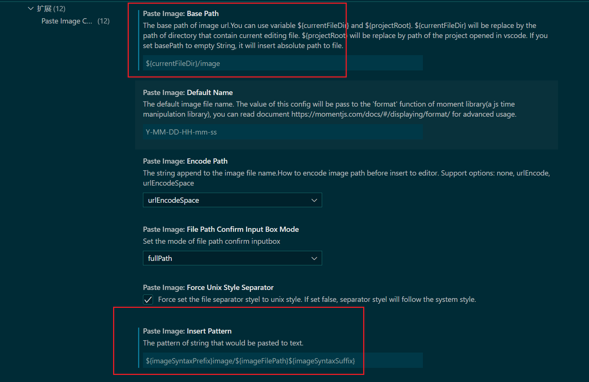

# markdown 工具

## VSCode配置Markdown
最新发现Typora收费了，想着还是vscode大法好，果断转移到vscode上，我喜欢使用typora的一个功能是可以粘贴图片，自动将图片文件拷贝到文件夹下的某个地方，然后发现vscode上也刚好有这样的能力。介绍两个vscode插件

**1. markdown previvew enhanced**

**2. paste image**

