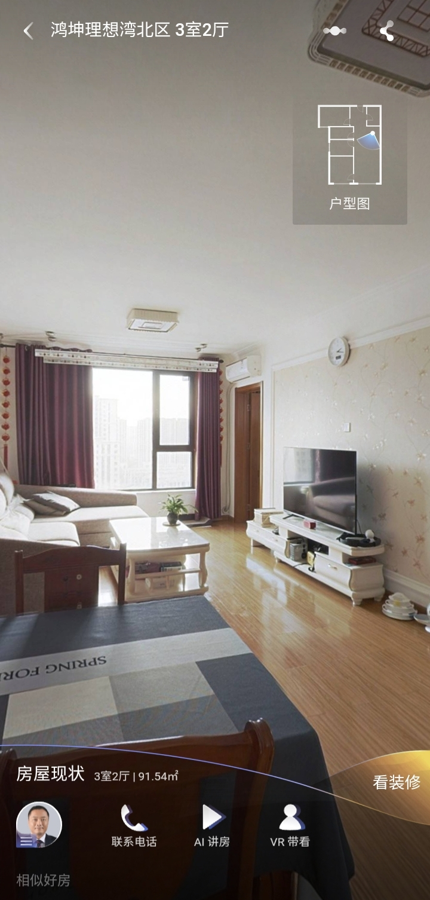
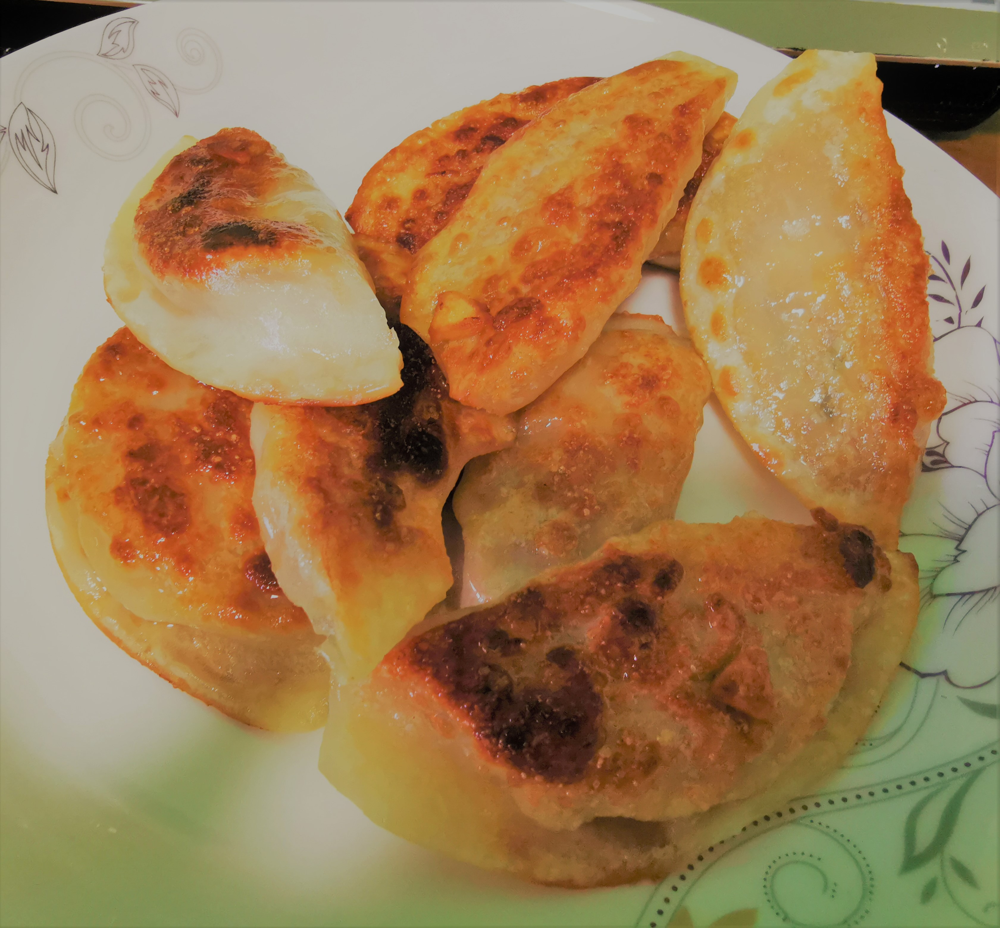

# 2020-12-19

## 早晨

芬芬周五晚上没有回来，她去了刘蒙那住，我昨晚赶PPT，也是很晚才睡，早上醒来的时候已经八点半了，9点多起床，吃了苹果，之后又开始继续写PPT

## 上午

PPT创作中...

快11点的时候，芬芬说吃了午饭回来，我自己煎饺吃，自己第一次自己做

## 下午

饭后，我又接着开始PPT创作，义无反顾

三点半，芬芬回来，我们在幸福超市相会，去超市买了菜回来，五点多开始做的饭，吃饭然后看KPL总决赛，最终DYG以4：0战胜AG超玩会，势如破竹。

晚饭后，我又继续写，其实已经很疲惫了

## 晚上

十一点半，Go To Sleep