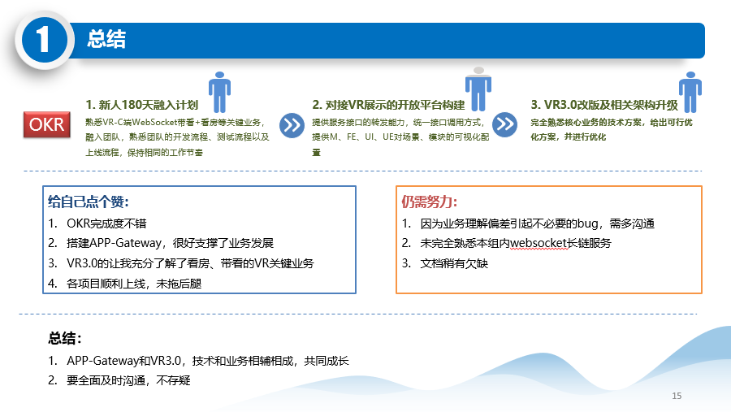
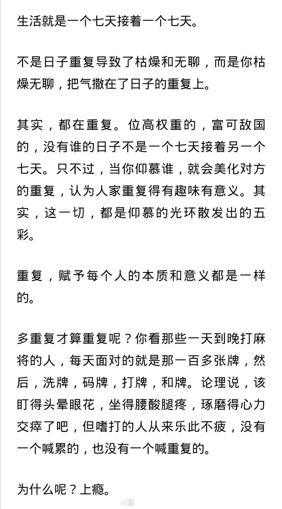
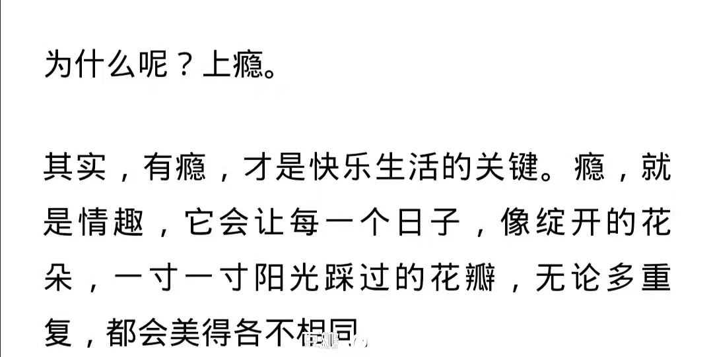

# 2020-12-20

发现迅雷的这个图标倒是蛮好看的，现在的迅雷像是沉下心来好好做产品了。

## 早晨

从卫生间回来，把粥煮上，红薯蒸上，用的是慢火，静下心来，不用着急了

吃完饭，其实又到了要写PPT的时间了，下周五述职，好在是还有好几天的时间

芬芬起床之后，我们在床上疯玩了半个多小时，累了，这才开始

## 中午

12点多，主卧同学都已经做好了饭

我们要煮意面吃，没西红柿和青椒，我去小区广场的菜棚里去买，西红柿也只剩下几个，我挑了两个看起来还不错的回来

## 下午

一点四十多午睡，2点多芬芬我把闹腾醒，后又睡着了，三点半多的时候醒来，睡的多了，迷糊起来，最后毅然起来，不过是因为PPT还差最后的**总结/规划**，一页也要写好久，要构思各种，不能太繁琐，也不能太简单，布局要好看。

总结下说：

创作的过程是痛苦的，但是创作出来之后，是舒适的，要我说，创作的过程就像生孩子，生下来之后，就如同心头的一块大石头落地，浑身都轻松了。

终于，终于，终于，差不多算是完成了一版，不管后面需不需要再进行大改，但此刻我的心是宁静且舒适的

