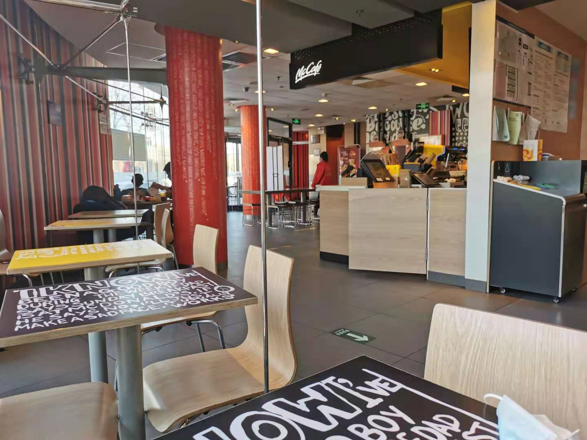
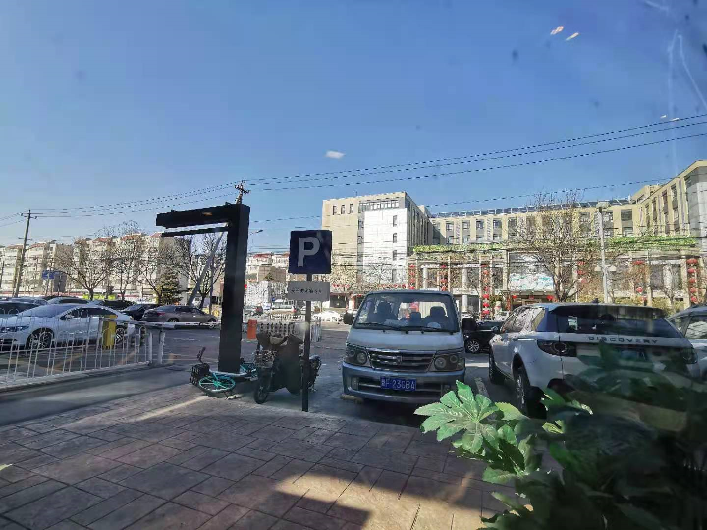

# 2021-02-16

## 上午

醒来就快9点了，睡眠还很不错，起床-->上厕所-->蒸粘豆包-->返回电脑前工作，《唐人街探案3》的豆瓣评分又下降了0.1分，《你好，李焕英》的评分维持在8.3

票房开始反超了

## 中午

坐车去麦当劳吃午饭

蓝天一点云都没有，但是同时也刮着大风，待到两点半左右我们走去了幸福超市买菜，后天上班，想想就觉得悲伤

## 下午

下午的时间，看了一部电影《开心鬼救开心鬼》