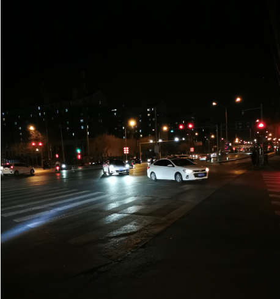
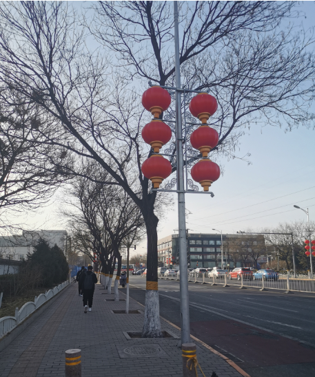
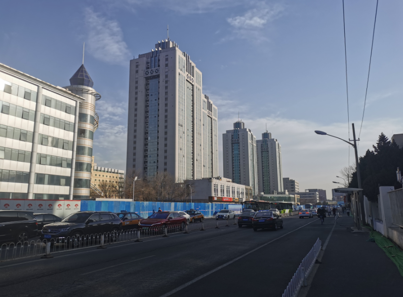
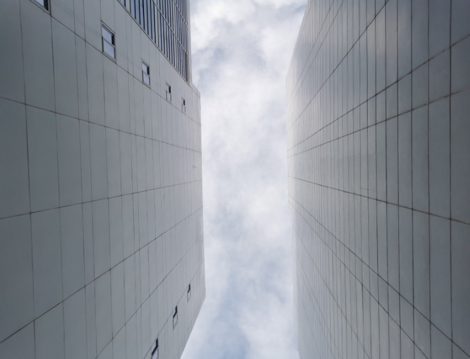
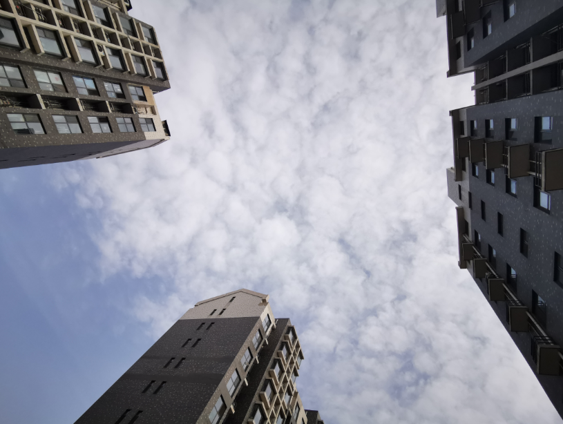
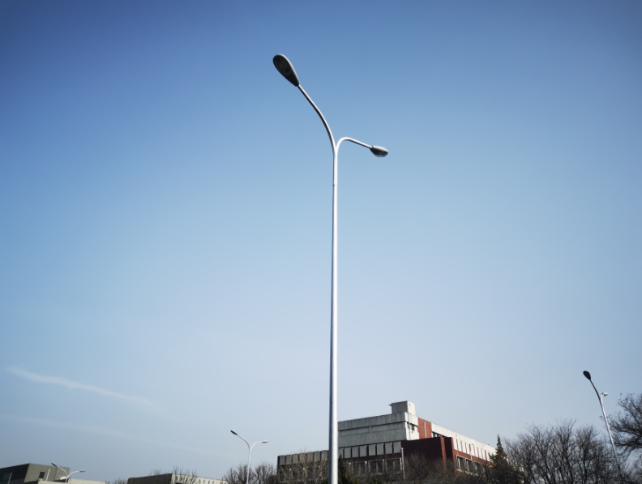
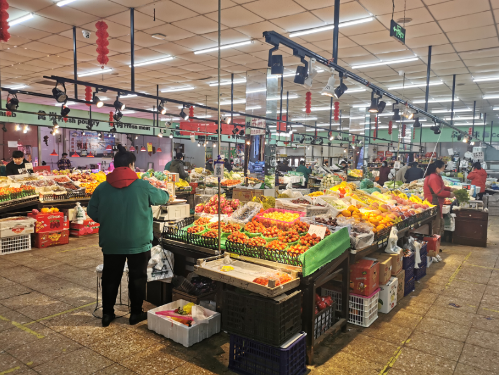
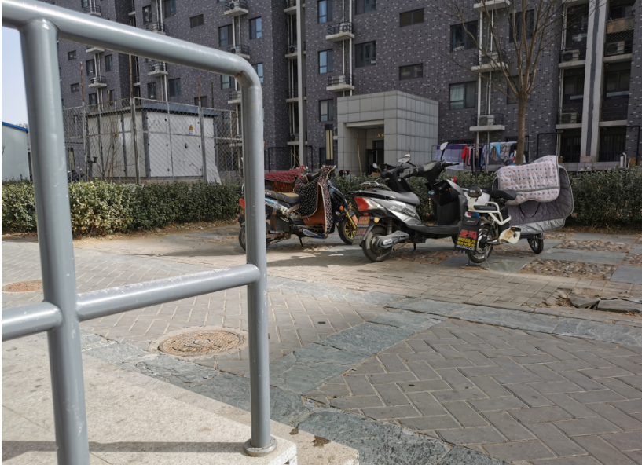

# 2021-02-21

#### 回顾

上了三天班，然后又放假，假期说过就过去了

- 周五的晚上

- 周六上班早上，灯笼还高高挂着

  

  然后天气也很不错，太阳很好，温度也很好

  

  早饭出来拍的照片

  

## 上午

早饭是芬芬从公司那边食堂带回来的包子，一大早多点送菜上门，也带来了豆浆，中午吃火锅，出门去买一点小葱，是周日，天气也是很棒的

## 下午

中午吃了火锅，外面太阳很棒，但是太晒，没呆多久就回来了，将冬天的几件衣服拿出去晒了

## 晚上

蒸饺、香椿苗拌豆腐豆皮