# 2021-03-27

## 上周回顾

- 周一天气很不错

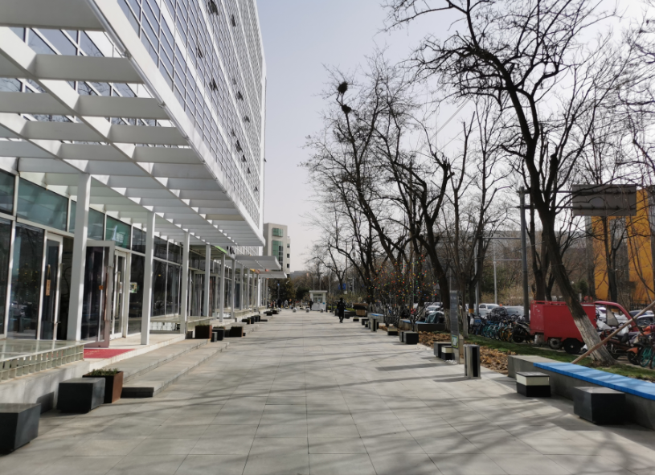

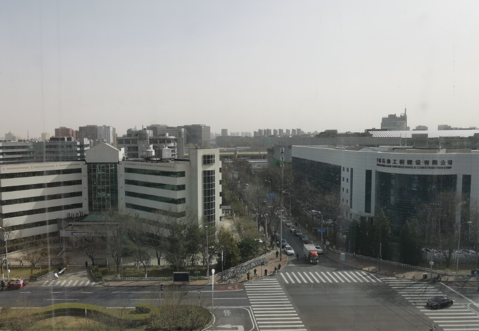

- 周三晚上羽毛球之后，坐车688回来，公交车上空荡荡的

- 周四，早上上班的途中，看到树村公园的花都开了，春天的气息很浓

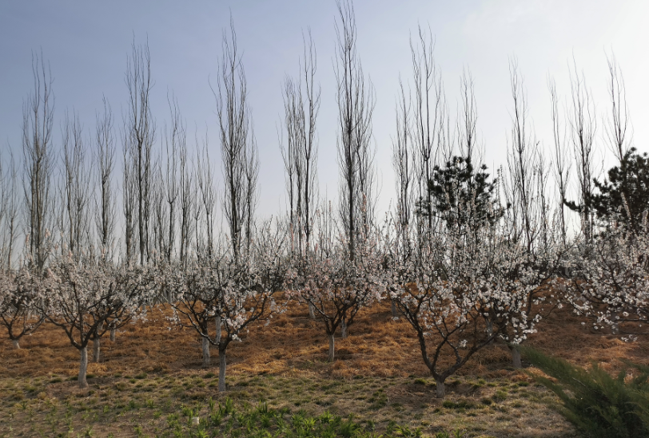

## 上午

早上，芬芬起床煮了粥，我们早饭之后，去幸福超市买菜，多云的天气，微微的太阳，微风也是暖暖的，很惬意

回来途中

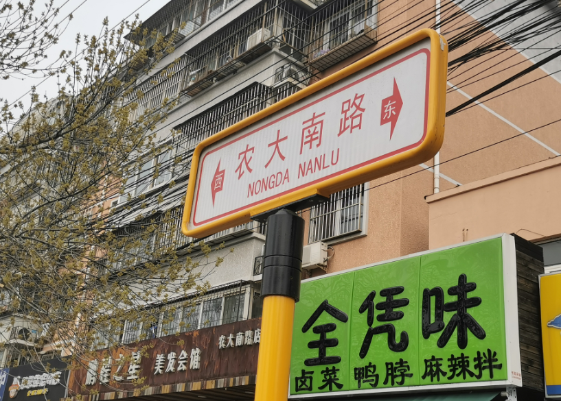

芬芬做午饭的时候，我拍了一些想要卖出去的东西放在闲鱼

## 下午

下午一点左右，也就是吃完饭后不久，我们就出门了，去地坛公园。

在雍和宫地铁一出来，就是这条河

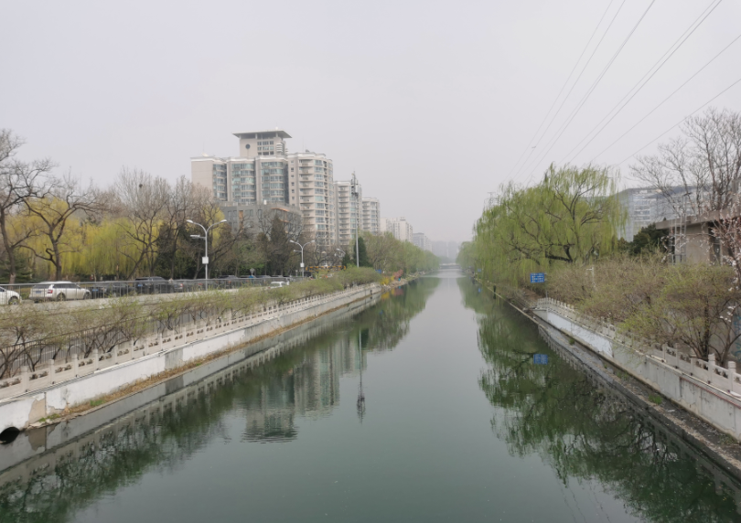

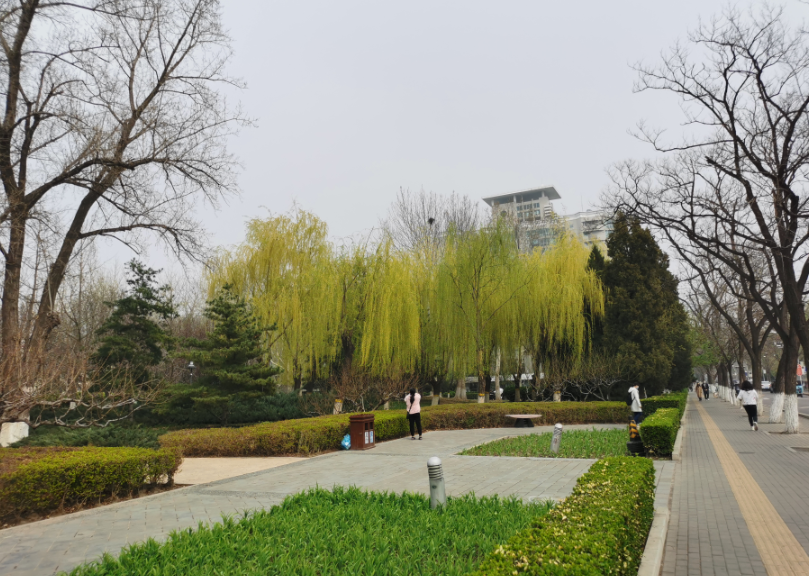

路过路边的一个小小公园，走过去，看到盛开的花

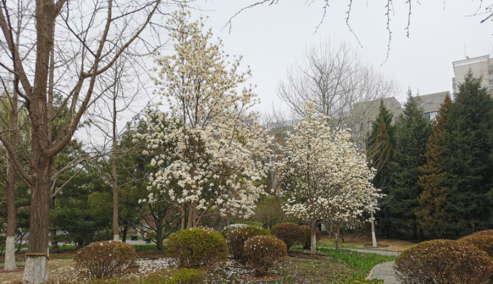

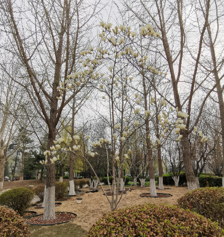

进了公园，人很少

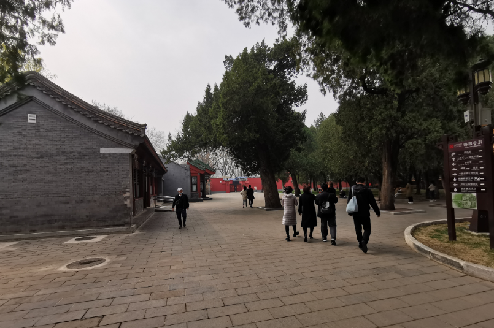

看到一棵大树，有400年的历史呢，明朝开始就屹立在这了

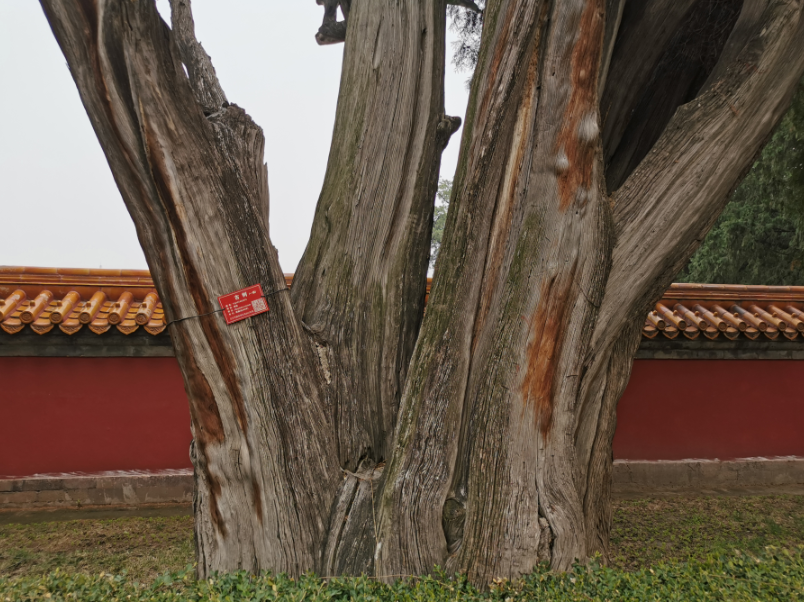

散步，走走拍拍的

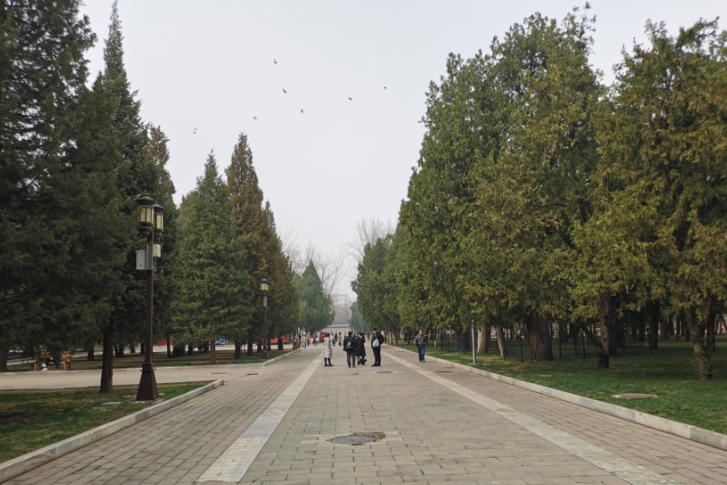

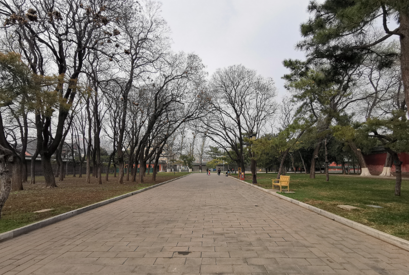

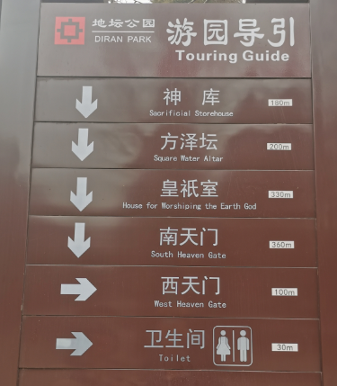

