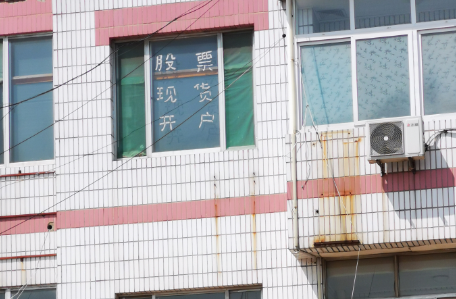
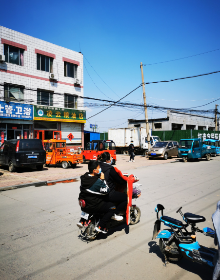
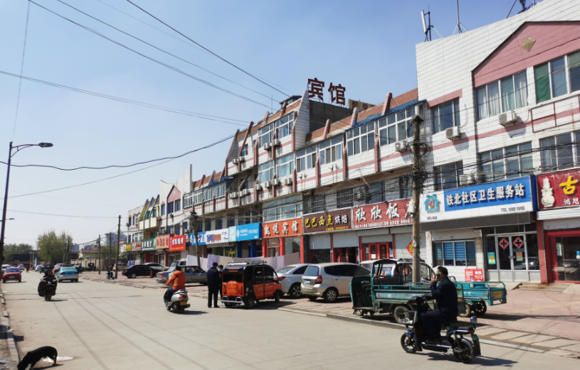
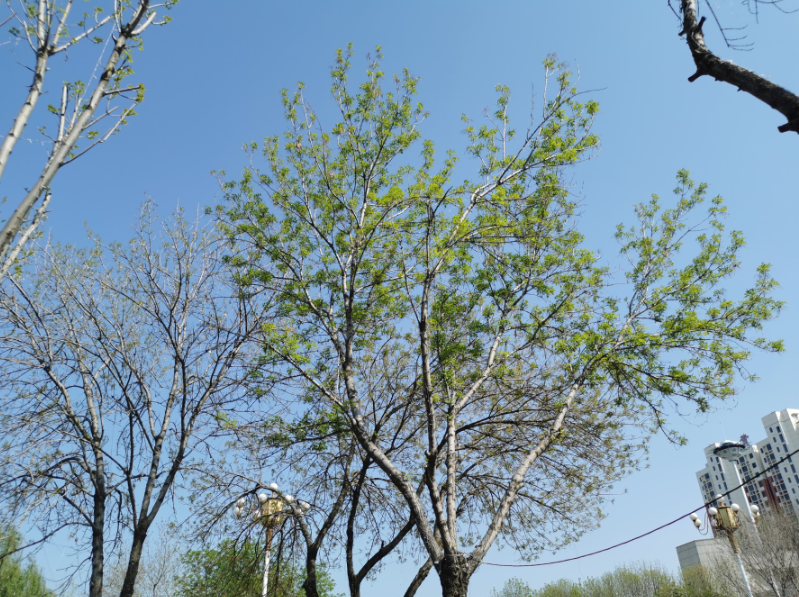
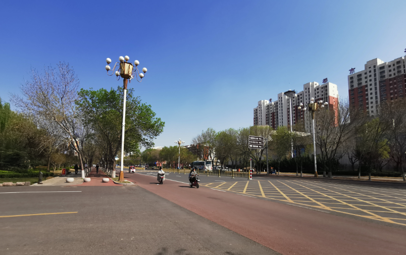
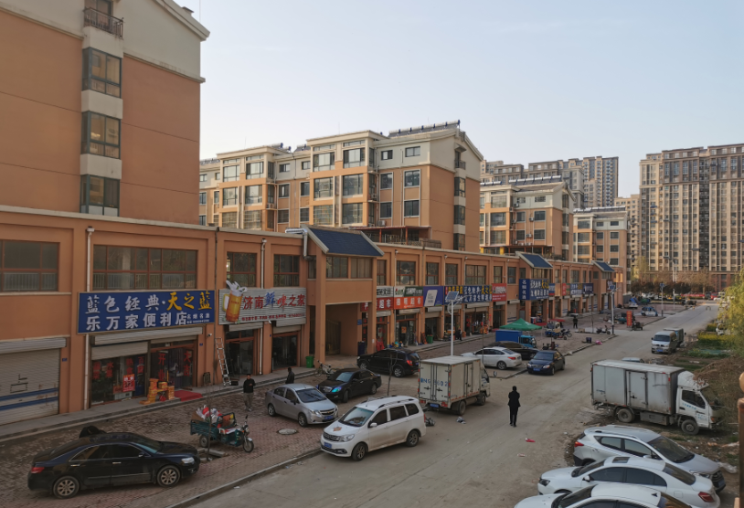

# 2021-04-04

## 上午

早饭是在家吃的，饭后，我们去菜市场买菜，我抓拍了一个这个

买了虾，买了蛤蜊回来，饭做好了，等着芬芬妹妹从学校回来，1点多开吃

## 下午

下午去见芬芬的another闺蜜，天气很好，树已绿了

见面实在一家咖啡馆，聊天了许久，因为是清明节，她有事儿离开，芬芬要给王可可买生日礼物，最后去德佰买的，王可可家新开了商店

快6点多，我们骑车回来，在路边烧纸祭奠

## 晚上

等待志伟下班回来一起吃火锅，7点多我们出发，晚上真难打车，走走停停打车，也打不到，最后还是走到了火锅店，已经接近8点了，吃火锅，喝啤酒到9点半，我们打车回家。休息了会儿，我洗了澡睡了。