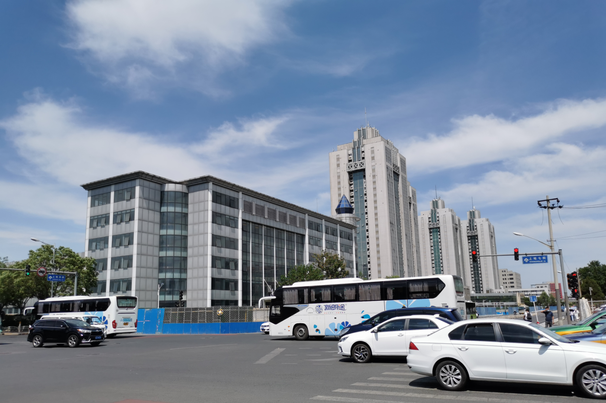
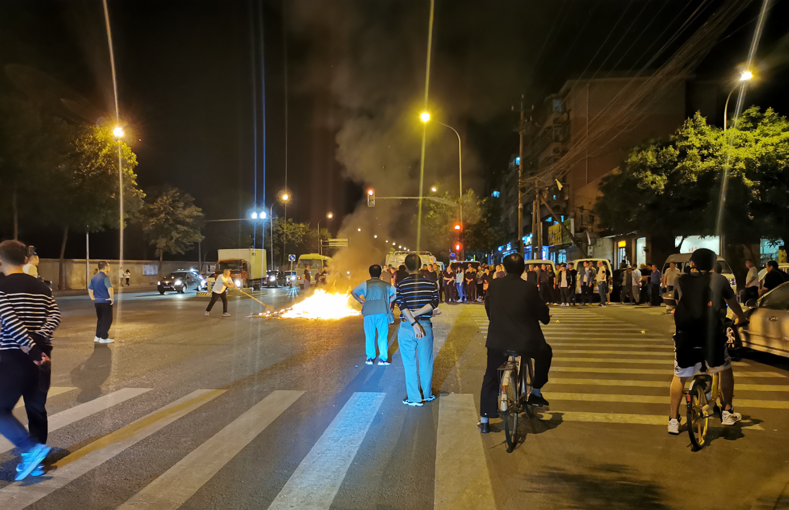

# 2021-05-22

## 上周回顾

这一周的气温都很高，芬芬去杭州出差，公司培训，一直到周五晚上才回来。

周四下午，我们公司的CEO左辉突然宣告因疾去世，震惊了我们所有人。

- 周一中午的好天气

- 周三晚上下班回来，在幸福超市的那个入口，看到有人在路中间烧了一大团火，很多人在围观，不知道是在干嘛

## 上午

上午我鼓捣华硕笔记本电脑上的Ubuntu系统，想要安装下wine和window版本的企业微信，下载wine的时候很慢，在这期间，我看完了电影《第十一回》

## 中午

中午和芬芬一起去了西直门的凯德mall，和大熊、刘蒙他们一起吃了火炉火自助烤肉，不同以往的烤肉需要自己去拿，我们只需要在小程序上点好就行，到地方的时候已经快一点了，吃了一个多小时后，我们一行人在商厦里转悠了会儿，给芬芬买了染发剂之后，我们又坐地铁回来了。

在商厦里逛游的时候，发现

在她们逛店，我在门口等待的时候，又看到了新闻：袁隆平去世的新闻，又一个让人震惊的新闻。

## 晚上

下午回来之后，我又继续折腾Ubuntu上的wine，最后终于成功安装了企业微信，又看完了电邮《我的姐姐》，晚饭煮了螺蛳粉、蒸了饺子，看了KPL比赛。

从9点半的时候开始下雨，一直到12点，我们准备睡觉了，雨还一直下着，难得下这么久的雨。