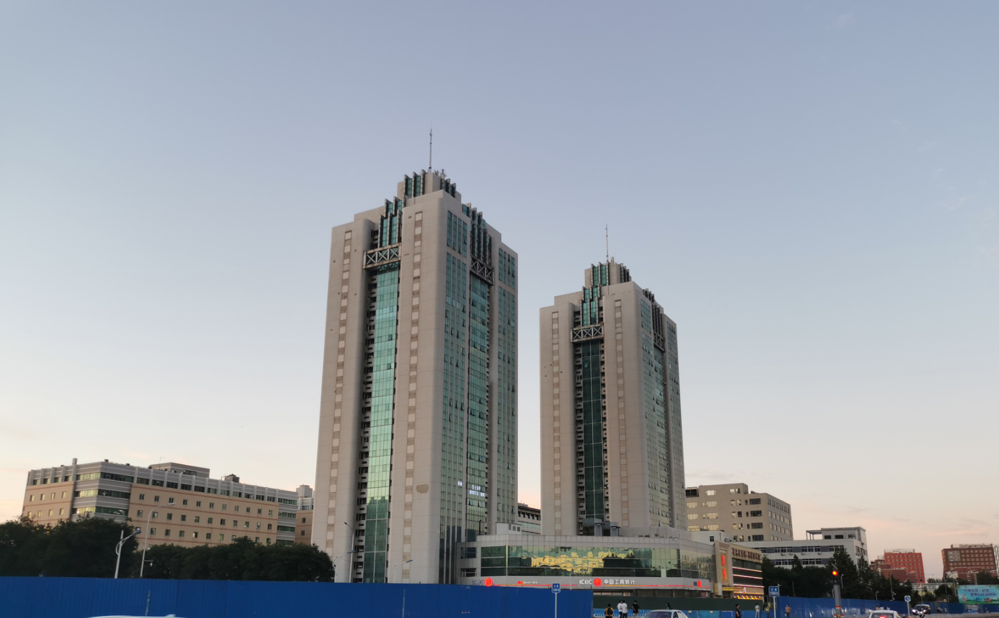
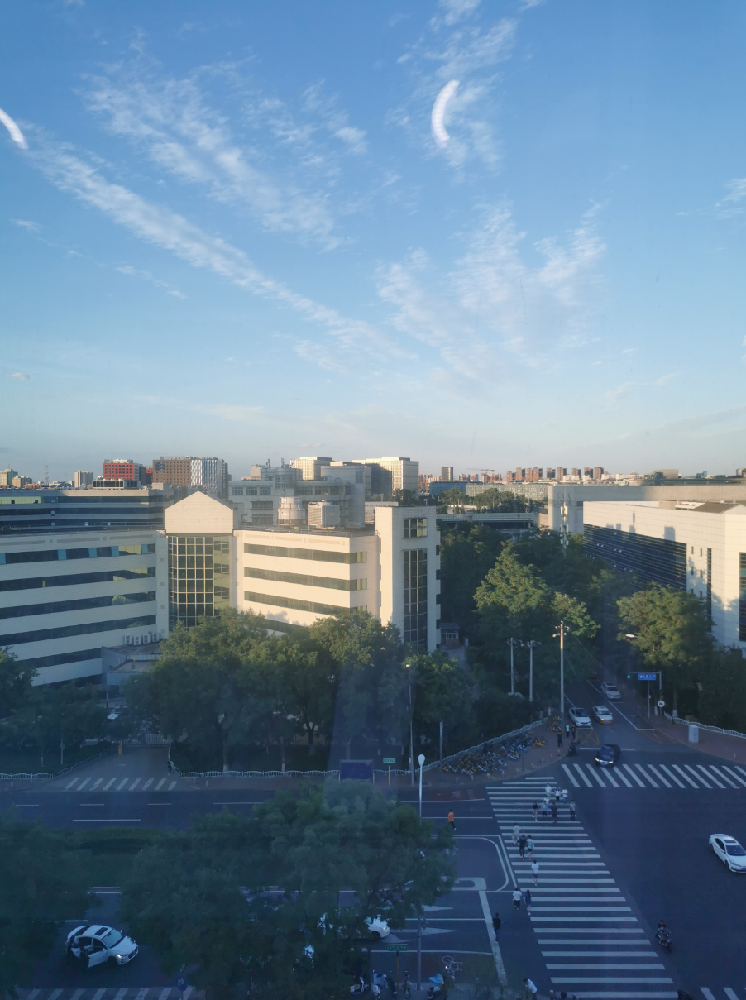
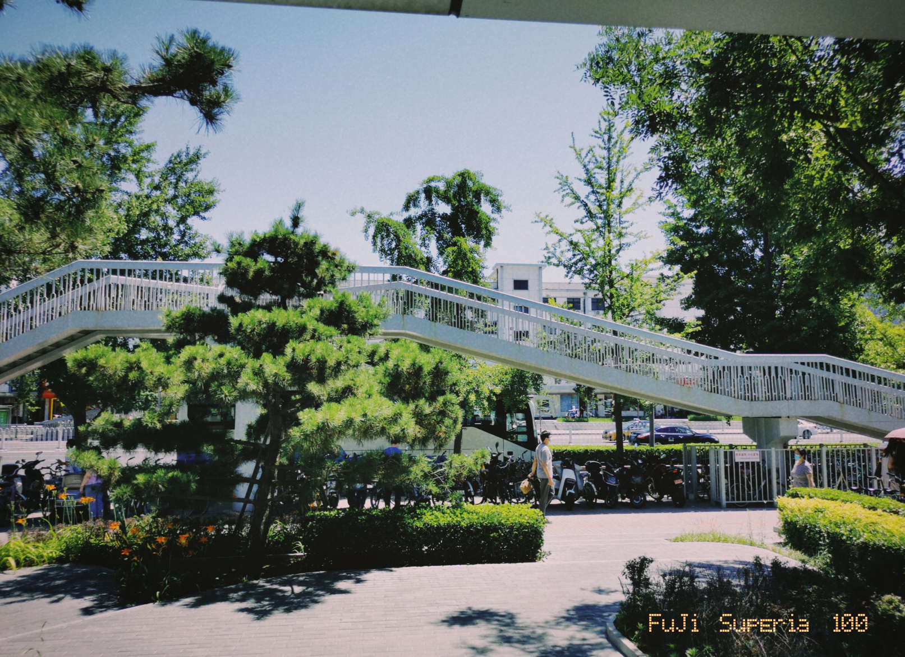

# 2021-06-19

## 上周回顾

- 周四傍晚

## 上午

上午起床之后我写了会儿代码、年中述职PPT，11点多的时候我们坐地铁去国家图书馆，芬芬像借几本书看，已经想不起来上次去图书馆是啥时候，只记得那时候还住在怡美家园，差不多有三年的时间了。外面的太阳是真大啊，火辣辣的太阳，地铁里是凉爽的，一出门就是地铁，坐上四五站地就到了，在国家图书馆门口被拦住了，原来是要提前预约，不知道是什么时候开始的，我们完全不知道，再去微信上预约的时候，已经没名额了。

在路旁的小亭子里休息片刻，在高德地图上寻找了个遍，没有好看的电影可以看，也没有好吃的值得去，最后又坐地铁回去了。

回家之后煮了两包螺蛳粉吃，吃完，我们就午睡了。

## 下午

午睡醒来，三点多，芬芬还在睡，我起床继续写我的PPT，一直到五点半多的时候，PPT出版雏形算是ok了，长舒一口气，外面太阳也还是很大。我们决定去游泳馆，说走就走，拿上泳裤浴巾，我们就出发去了，7点多的时候结束，我们出来又去幸福超市买了点凉菜回来