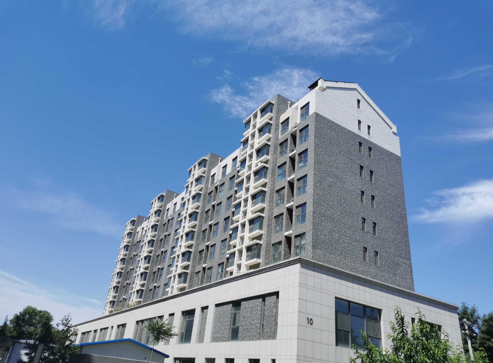
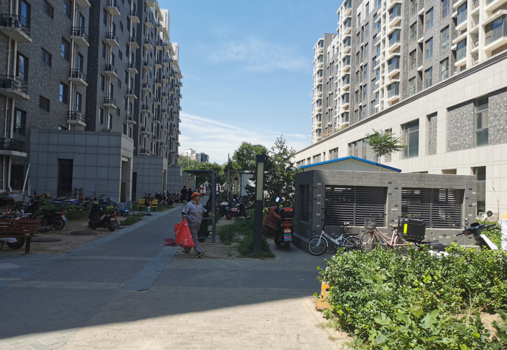

# 2021-06-21

## 上午

早上起床做饭，蒸包子、煮粥、切水果，芬芬起床洗了衣服，11点多去买了菜，外面太阳也好大，晒的人睁不开眼睛

芬芬提前在多点上买了肥牛，中午煮了酸汤肥牛，很是美味，米饭都吃完了，一边吃一边看的《向往的生活》，觉得很无聊了，饭后我又睡了，刚好一点多。

## 下午

睡了一个小时，醒来，整理github上的日记

五点多的时候去健身房游泳

7点多结束回来做饭吃