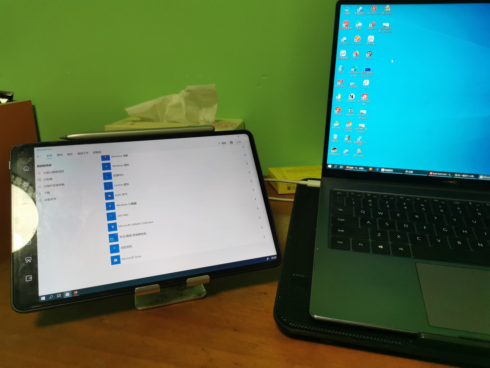
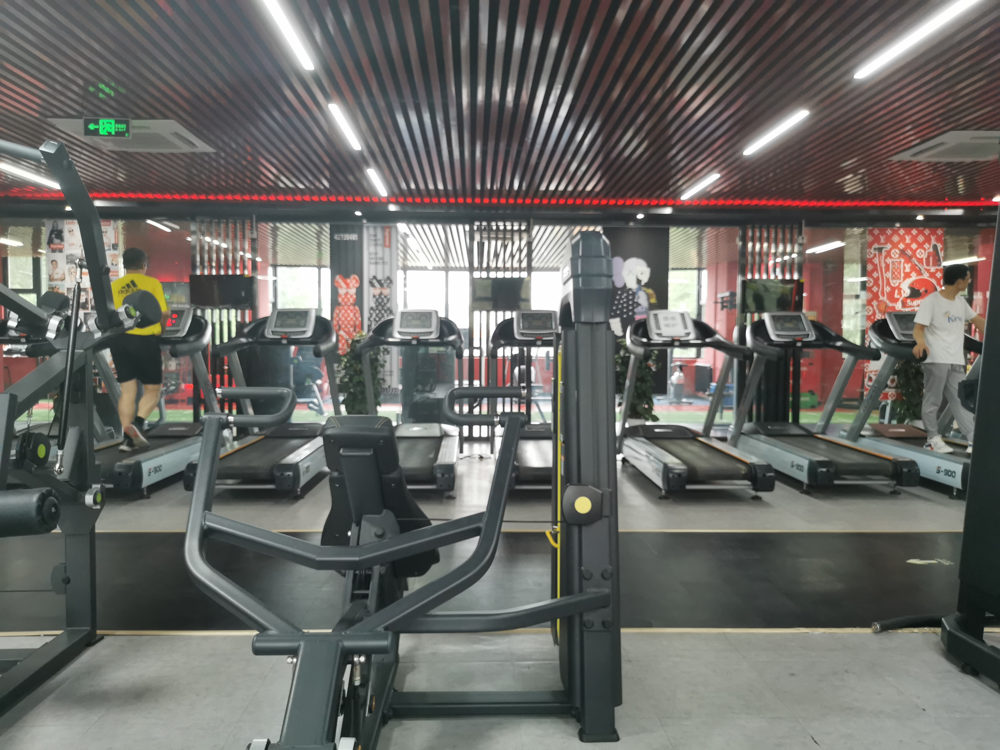

# 2021-06-26

## 上周回顾

- 周三晚上，华为的MatePad的鸿蒙系统再次更新，可以当作华为笔记本的副屏使用了

- 周四的时候，老板说下周五述职，也就是7.2述职，可真是猝不及防，好在是再端午节期间，我已经开始准备PPT了
- 周五晚上下班途中下雨了，越下越大，瞬间凉爽了

## 上午

早上3点多醒来，手机上刷知乎了很久，依然没有困意，我又蹑手蹑脚起床，打开了电脑，看了一会儿工作上的代码，一直到6点多我又继续去睡了，一觉醒来，已经9点了，回笼觉睡的舒爽，我起床煮了粽子，算是早饭。

上午的一上午的时间都是在修改PPT中度过的，12点多做饭，西红柿炒鸡蛋、炒青菜，蒸米饭，老几样，但就是吃不腻。

## 下午

午睡醒来，我开始写工作上的代码，一直到4点半的时间，芬芬也在桌子的另一头。

- 5点，我们收拾去了健身房，锻炼

- 5点40，我们去负一层，游泳池的人好多，我们打了两盘台球，不太会，就是瞎玩儿，等游泳池的人少了，我们再进去
- 6点半多，KPL总决赛开始，但是游泳池的人并不见少，索性就当场看比赛
- 7点多，我们决定今天不游泳回家了

在天桥陈那买了夫妻肺片回家，蒸上米饭就好了

晚上一直看KPL总决赛，很是精彩，一直到11点多才结束，Hero依然是赢下了比赛

