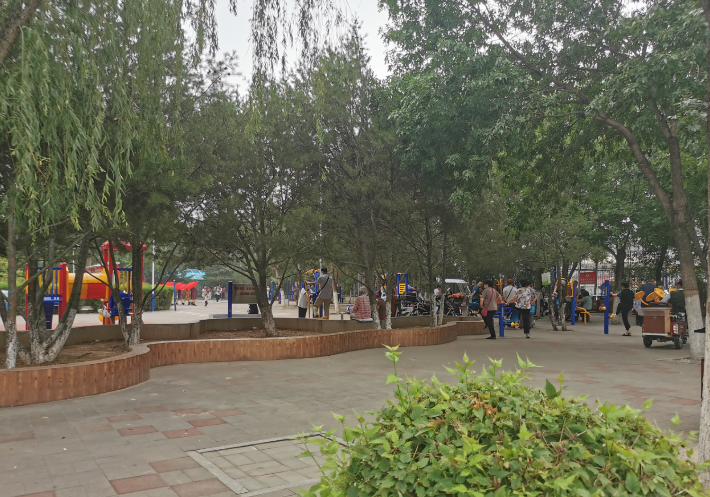
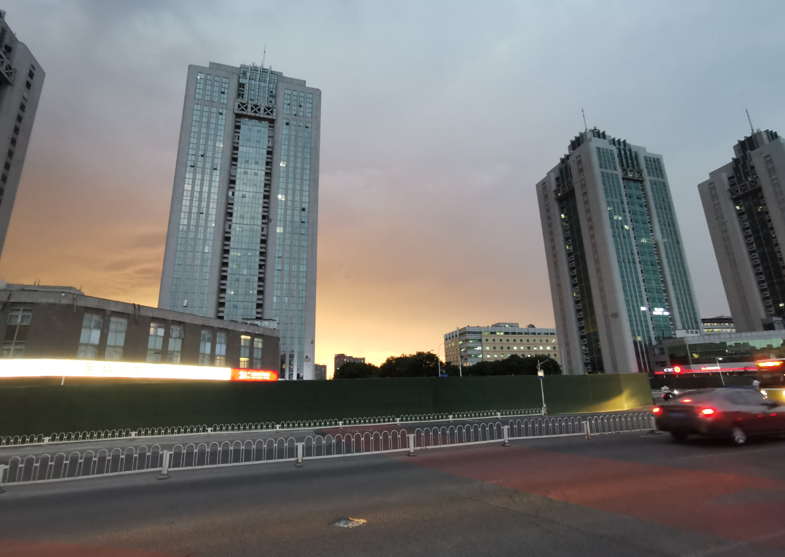
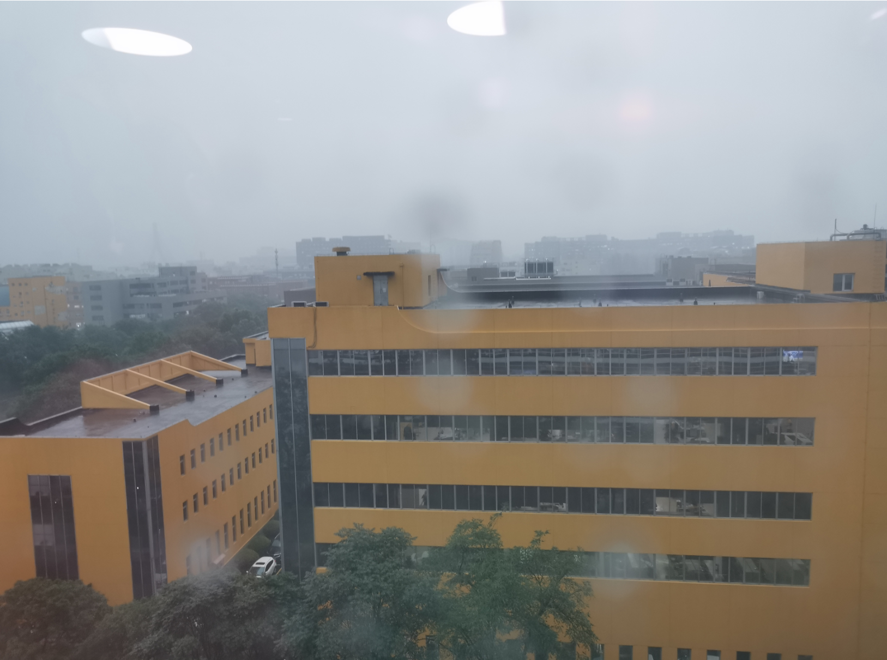
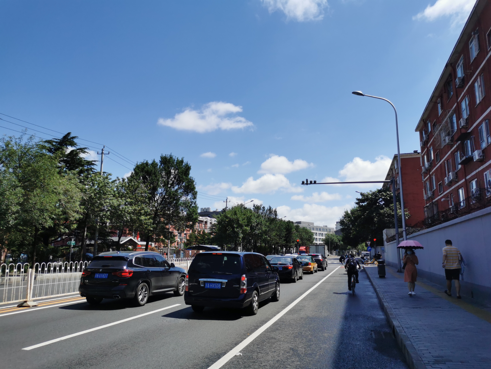
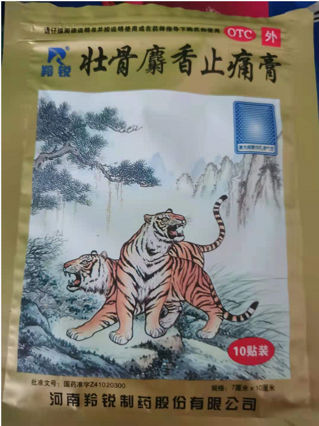

# 2021-07-03

## 上周回顾

- 周一早上上班途中看到路边公园锻炼的大爷大妈，很是羡慕

- 周三，最近雨量有点充沛，晚上吃完饭，看天上乌云密布

- 周四，外面又下起了大雨

- 本来周五是要述职的，但是没有找到会议室，推迟到下周一了，周五晚上下班回到家只有8点多，我硬要拉着芬芬一起去健身房，做了简单的拉伸，然后游了几圈回来。周五的晚上游泳健身的人还挺多，大概是周末来了，大家都很放松，来健身也是很放松的，心情愉悦的时候，干啥也都很起劲。

## 上午

早上醒来，看到外面的坑坑洼洼的地方都有积水，断定昨晚肯定下雨，但是我毫无知觉，很是罕见，窗户的隔音效果太好了，其实我是愿意被外面的雨声吵醒的。

> 夜阑卧听风吹雨，铁马冰河入梦来。

早上去幸福超市的路中，阳光很大，没有被太阳照到的地方很凉爽，但是太阳下有特别灼热。

在`幸福超市`买了排骨回家，中午炖了排骨吃，简单炖了下，也很好吃。

## 下午

一上午的时间都特别的困，在吃完午饭之后，我就睡了，睡了很长的一觉，醒来之后好多了，最近的这一周，一直要搞述职PPT，睡的不是很好，总是缺觉。

下午在`叮当快药`上买了膏药

在等待送货上门之后，我们去了罗森，这一路上，经过一个小的菜市场，我们进去买了热干面和煎饼，走到罗森转悠了一圈也没发现什么好玩的东西，外面又下起了大雨，我们就回来了，在华莱士买了一个汉堡和一个可乐回来，这些东西吃了就算是晚饭了。