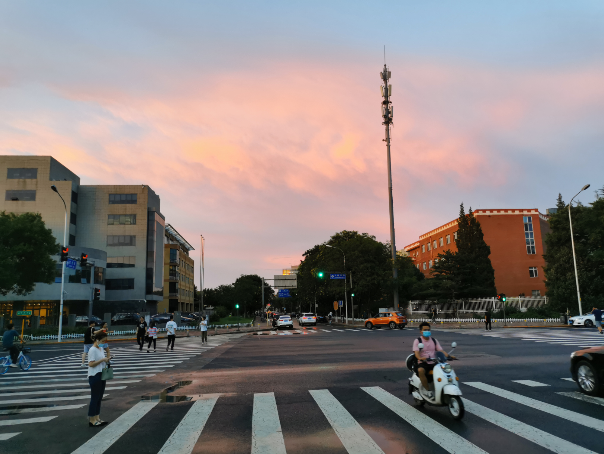
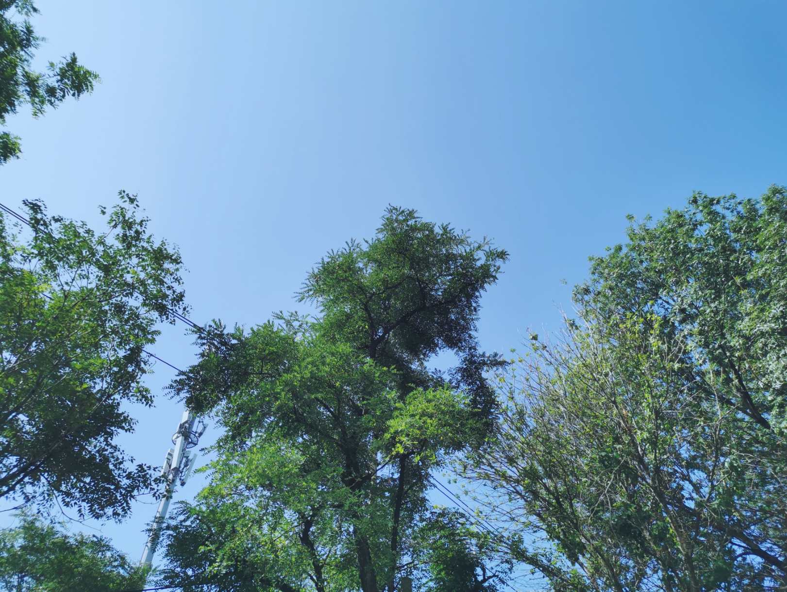
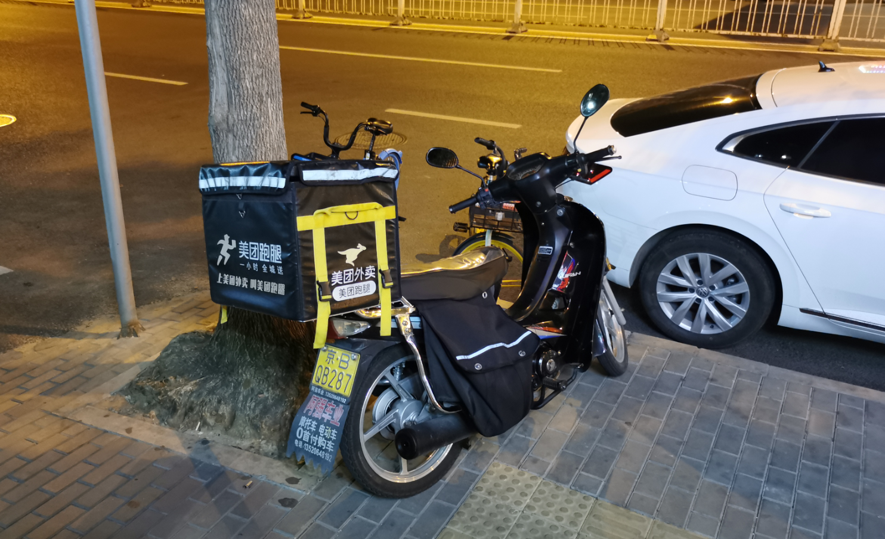
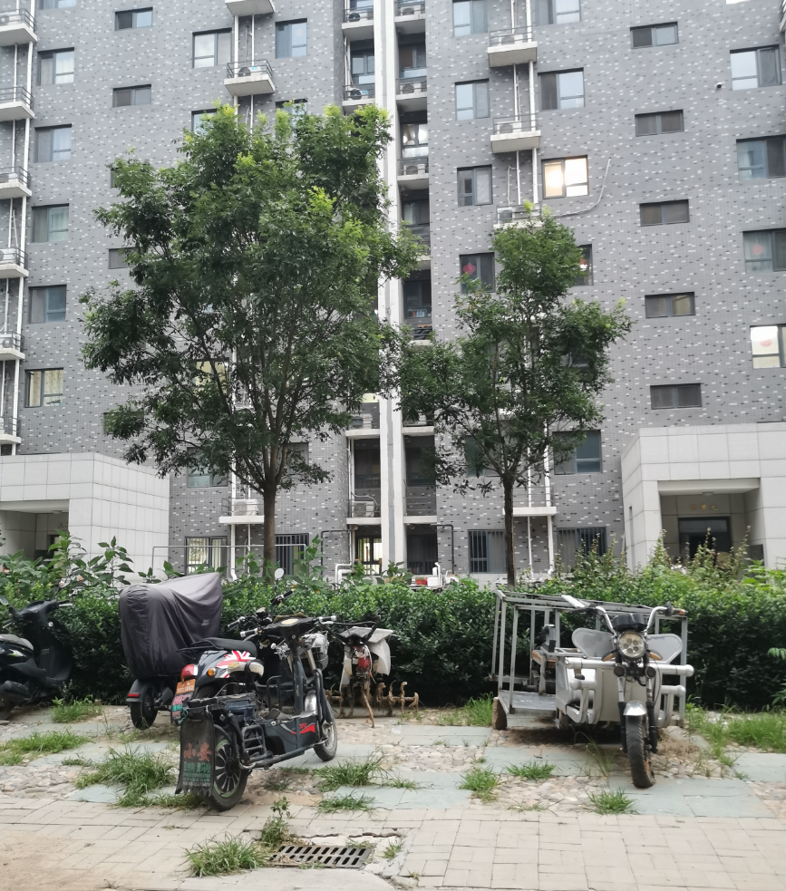
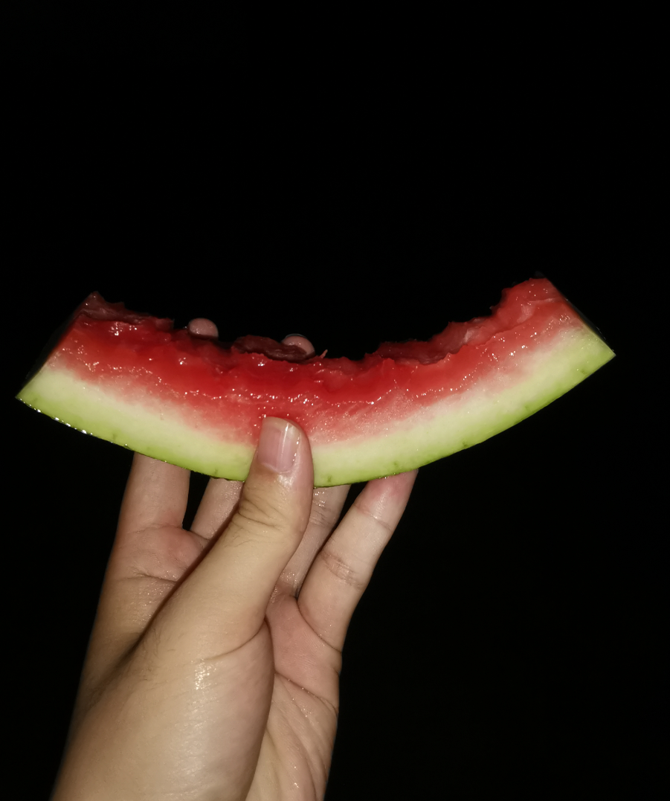

# 2021-07-10

## 上周回顾

- 周一，2021年中答辩
- 周四，傍晚天空很美的彩虹，一天的时间里都特别的闷热，下午突然下暴雨，过后天便晴朗了

- 周五，是一个晴朗的天气，早上上班拍下来的，晚上8点多，我和芬芬去上地三街的`管氏翅吧`吃了烧烤，然后骑车回家了

等待进入`管氏翅吧`

晚上回来，在小区门口，芬芬去买饮料

## 上午

上午时间里，我在电脑上写代码，芬芬也坐在桌子对面，午饭炒了青菜、西红柿炒鸡蛋，喝了啤酒，虽然热，但是我还挺喜欢出汗的感觉

## 下午

午睡了半个多小时后起床了，我继续在电脑上写代码，时间的啊，芬芬写PPT（她的转正PPT），五六点的时候，我的工作基本完成，我打算休息

## 晚上

晚饭炒了方便面，饿了的我，很快吃完，饭后出门溜达了一会儿，才7点半，外面天还很亮，之后便去健身房了

回来的时候，发现停电，洗了碗和泳衣泳裤，拿着一块西瓜就出门去了，外面好多人在游荡，一直到11点多，我们也会来洗漱，不久电来了，我们也准备睡觉了

