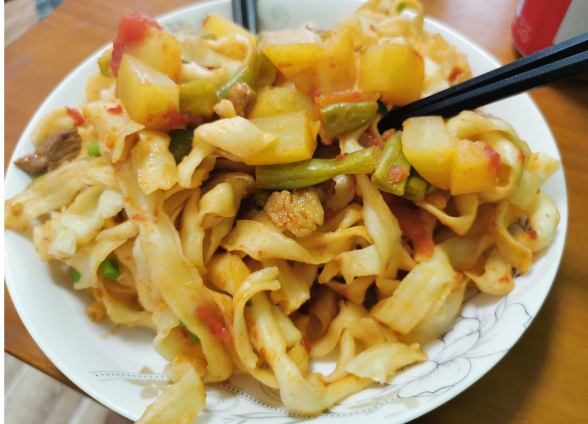
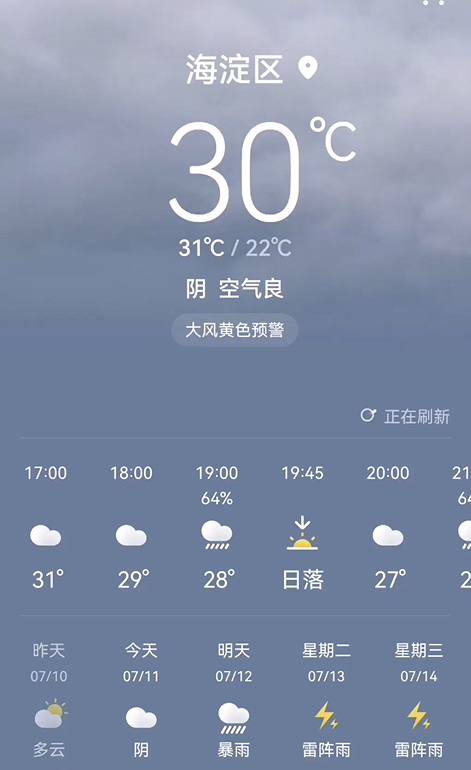
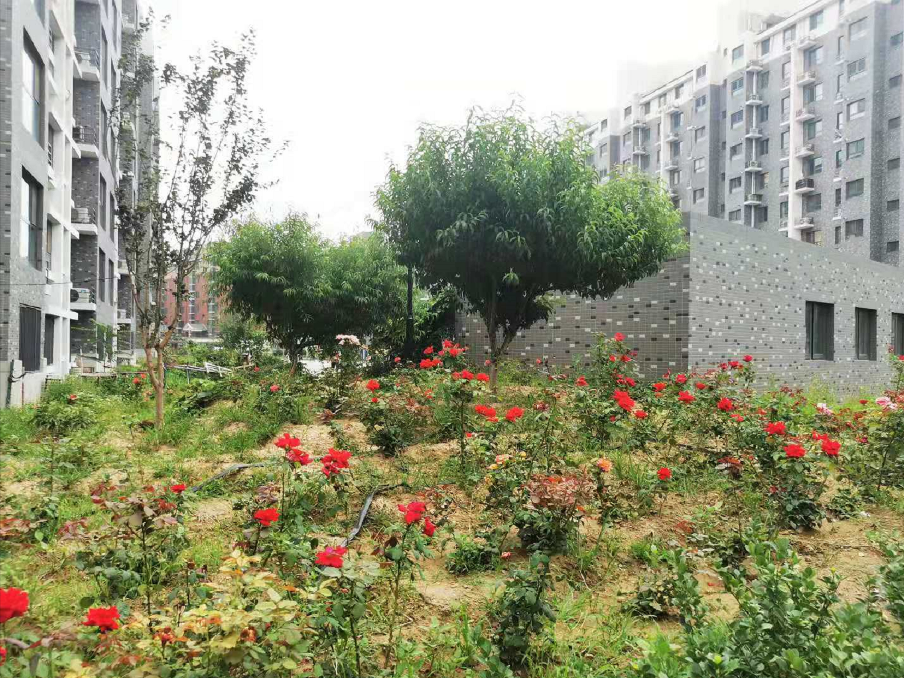
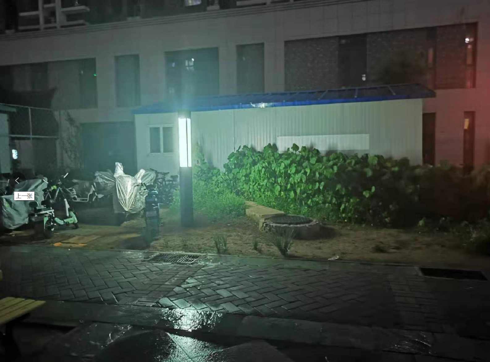

## 2021-07-11

## 上午

早上醒来的时候快9点了，我上厕所，芬芬起床准备早饭，面包片和黄金糕

饭后我们出门去买菜了，去的超市发，中午打算做扁豆焖面，11点多时候回来，外面没有太阳，阴沉沉的天气，但是很闷热，昨天和今天一直有天气告警，说是今晚夜间到明天有大暴雨，看着架势差不离了。

## 中午

中午的焖面很棒的哦

饭后我就睡觉了，被一通诈骗电话给震醒来了，之后便不再睡着了，芬芬在MatePAD上看贾玲的小品，我也跟着看，实在是好笑，带给人很多欢乐，虽然看过，但再看一遍，也是好笑的。

3点多的时候，我们去健身房拉伸胳膊，后面想去游泳，中途放弃，看别人打了一局台球就回来了，外面闷热的，等待着晚上的暴雨来临。

## 晚上

5点半的时候，我们就开始做饭，茄子炖肉，蒸了馒头，吃完出门游荡等待雨的到来

7点半的时候，雨终于下来了，下了一阵子，又停了一阵子

