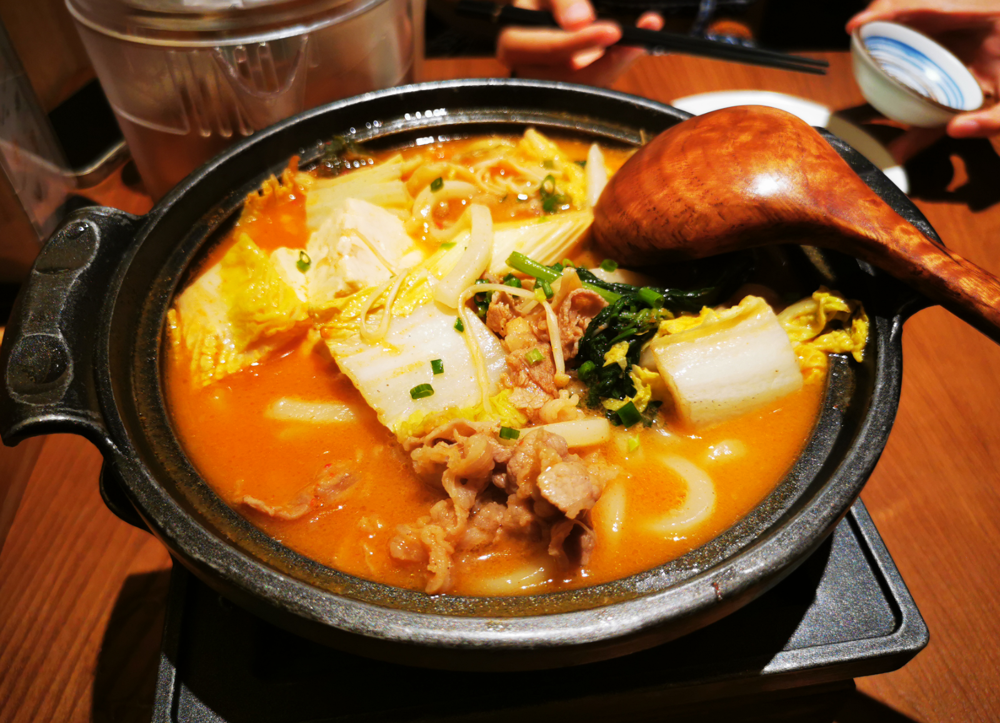
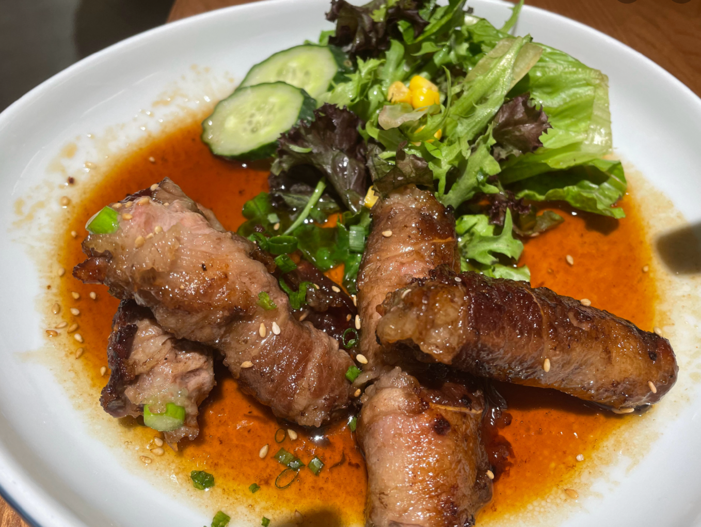
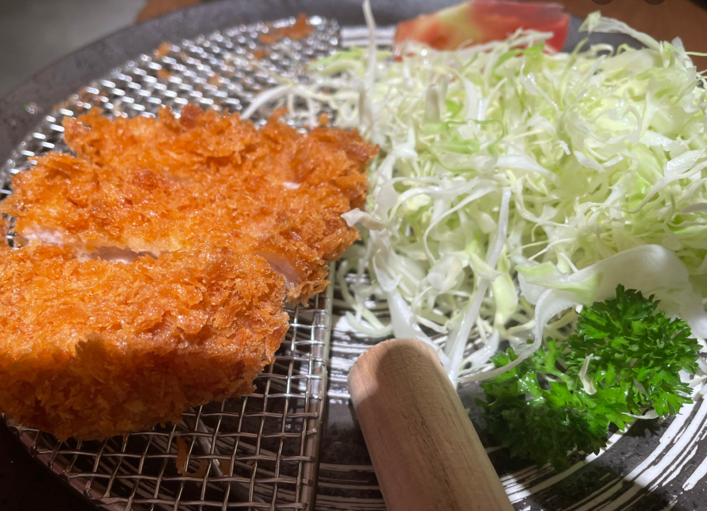
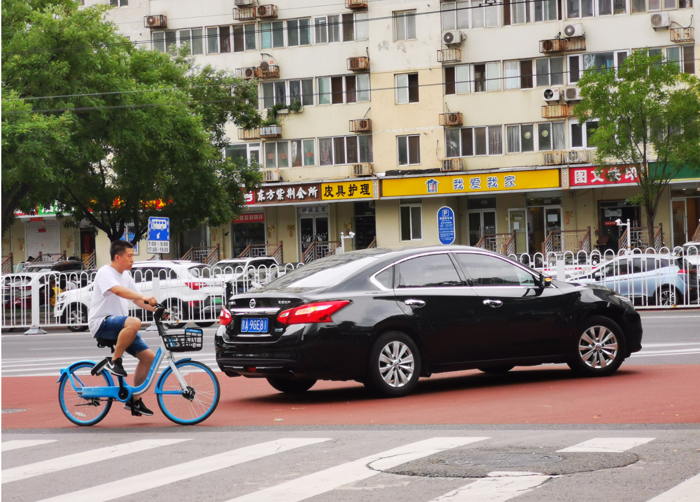
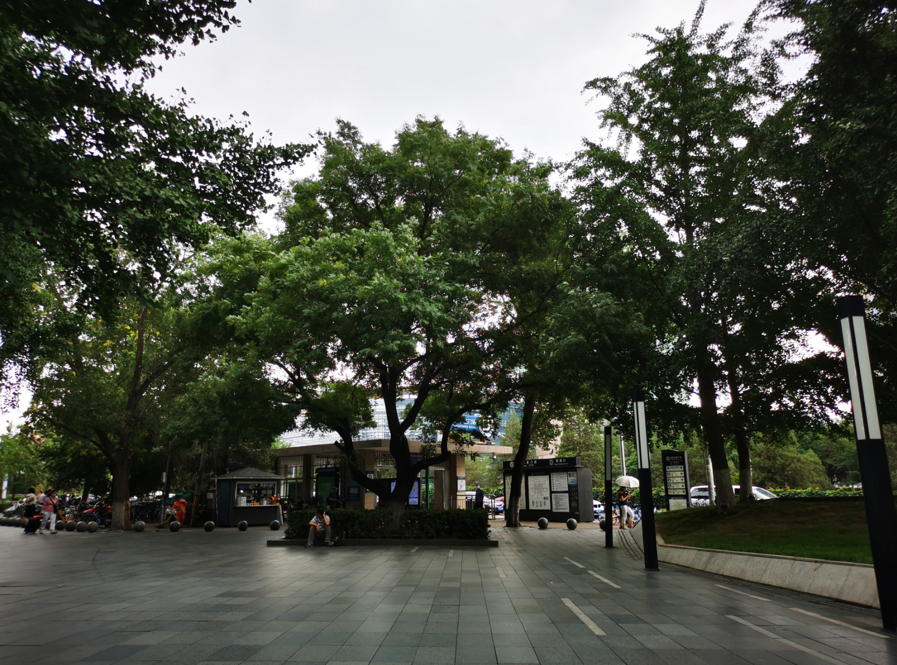
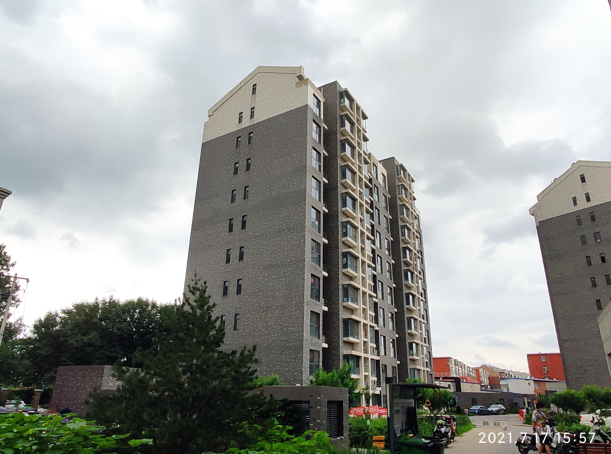
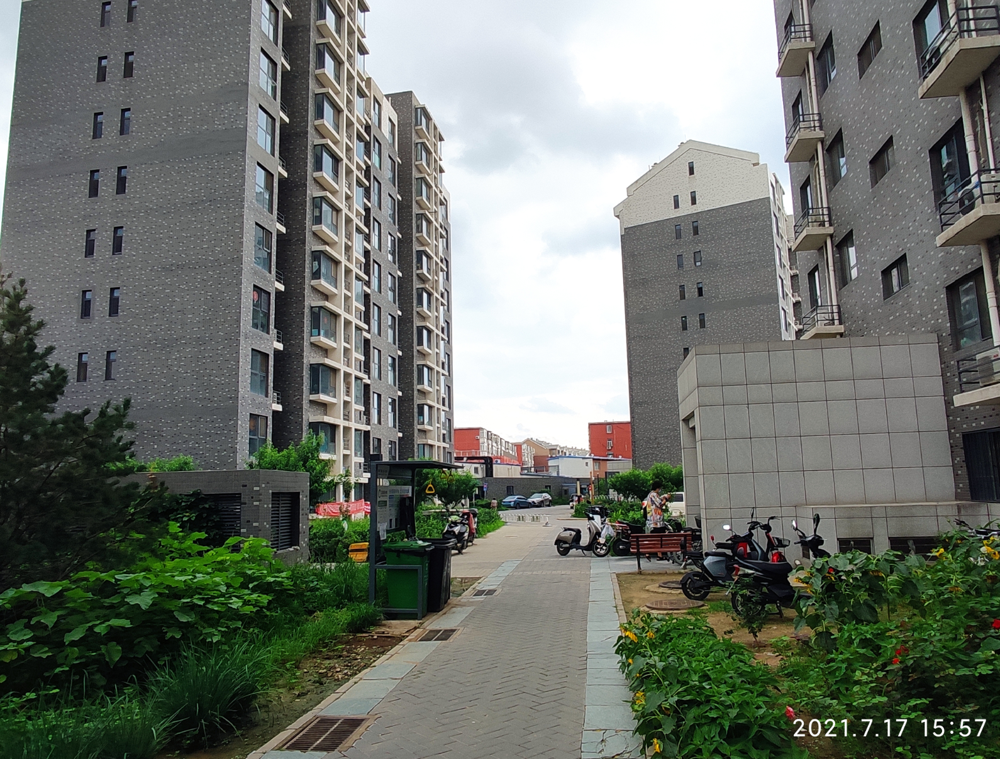
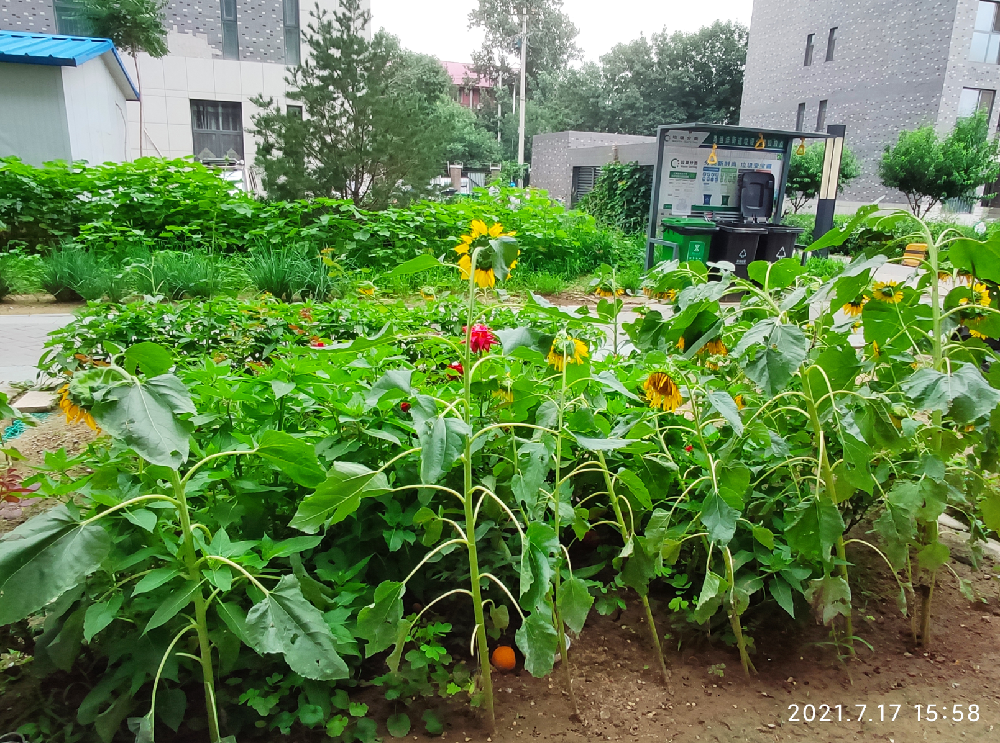
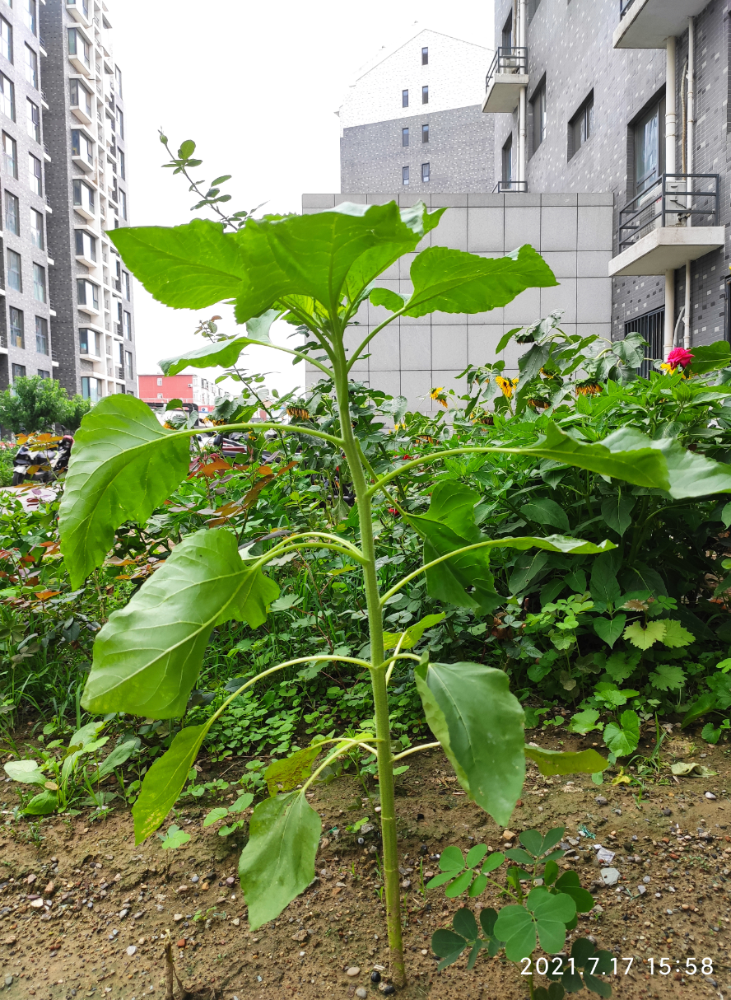

# 2021-07-17

## 上周回顾

- 周一下了大暴雨，预告了好久的暴雨终于下来了
- 总体来说这周还算容易
- 周三晚上，老板突然要各种数据，熬夜到很晚回去
- 周四晚上线NPS，最终也没能上去，熬夜到很晚回家

## 上午

一大早就开始下雨，后来雨停了，芬芬起床去买了好适口早餐吃，饭后芬芬收拾化妆，11点多我们出发去了东直门吃`九割`，是日料，很是nice的一顿饭。

饭后我们在商厦里转悠了一圈后又出来，外面很是凉爽，吹着风，温柔的风吹在身上，找了路边的一个可以坐着的台阶，发了呆，快三点多我们才回家。

## 下午

到家之后，我们又在屋外的长凳上坐了会儿

6点多开始看《西行记》，一口气看了15集，每集也很短，但是很好看，看完的时候8点多了，我煮了在京东买的螺蛳粉，吃完之后又打了好几把游戏，11点多雨还在下，洗了澡，九准备睡了