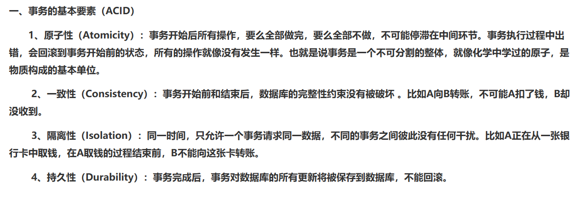
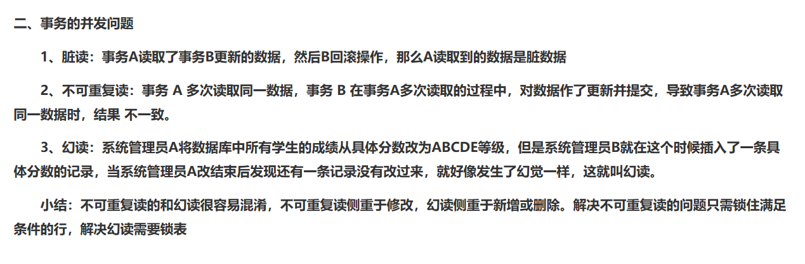
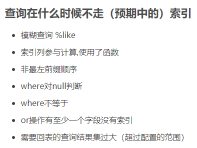

# MySQL

## 删除数据之后碎片整理
> https://blog.csdn.net/m0_54853503/article/details/126075896

## ACID

## 事物并发问题

## 事物隔离级别

| 事务隔离级别                 | 脏读 | 不可重复读 | 幻读 |
| ---------------------------- | ---- | ---------- | ---- |
| 读未提交（read-uncommitted） | 是   | 是         | 是   |
| 不可重复读（read-committed） | 否   | 是         | 是   |
| 可重复读（repeatable-read）  | 否   | 否         | 是   |
| 串行化（serializable）       | 否   | 否         | 否   |

## 索引：聚簇索引、覆盖索引

> https://zhuanlan.zhihu.com/p/488771839

## B+树怎样的

## MySQL 事务隔离级别

> https://www.cnblogs.com/wyaokai/p/10921323.html

### MVCC 多版本并发控制

> https://www.cnblogs.com/Jason-Born/p/7878401.html

## MySQL 日志系统：redo log、binlog、undo log 区别与作用

> https://blog.csdn.net/u010002184/article/details/88526708

## 如何加快 mysql 查询速度

## innode 与 myisam 存储引擎

## 索引 B+树的叶子节点都可以存哪些东西？

## 最左原则是啥

## 为什么选择 B+树作为索引结构？

1. 平衡多叉树，2 分查找快
2. 树高低，IO 少，几次查找就可以找到数据
3. 叶子节点存储的是数据，非叶子节点存储的是索引

## 查询什么时候不走索引？

## SQL 执行顺序

SQL 的执行顺序： `from` — `where` – `group by` — `having` — `select` — `order by`

## InnoDB 引擎的行锁和表锁

> https://code84.com/753862.html

- 行锁必须要索引才能实现，否则会自动锁全表
