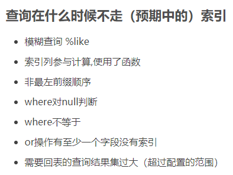

#### ACID

#### 事物并发问题

#### 事物隔离级别

| 事务隔离级别                 | 脏读  | 不可重复读 | 幻读  |
| ---------------------- | --- | ----- | --- |
| 读未提交（read-uncommitted） | 是   | 是     | 是   |
| 不可重复读（read-committed）  | 否   | 是     | 是   |
| 可重复读（repeatable-read）  | 否   | 否     | 是   |
| 串行化（serializable）      | 否   | 否     | 否   |

#### 索引：聚簇索引、覆盖索引

> https://zhuanlan.zhihu.com/p/488771839

#### B+树怎样的

#### MySQL事务隔离级别

> https://www.cnblogs.com/wyaokai/p/10921323.html

### MVCC多版本并发控制

> https://www.cnblogs.com/Jason-Born/p/7878401.html

#### MySQL日志系统：redo log、binlog、undo log 区别与作用

> https://blog.csdn.net/u010002184/article/details/88526708

#### 如何加快mysql查询速度

#### innode与myisam存储引擎

#### 索引B+树的叶子节点都可以存哪些东西？

#### 最左原则是啥

#### 为什么选择B+树作为索引结构？

1. 平衡多叉树，2分查找快
2. 树高低，IO少，几次查找就可以找到数据
3. 叶子节点存储的是数据，非叶子节点存储的是索引

#### 查询什么时候不走索引？

#### SQL执行顺序

SQL的执行顺序： `from` — `where` – `group by` — `having` — `select` — `order by`

#### InnoDB引擎的行锁和表锁

> https://code84.com/753862.html

* 行锁必须要索引才能实现，否则会自动锁全表
