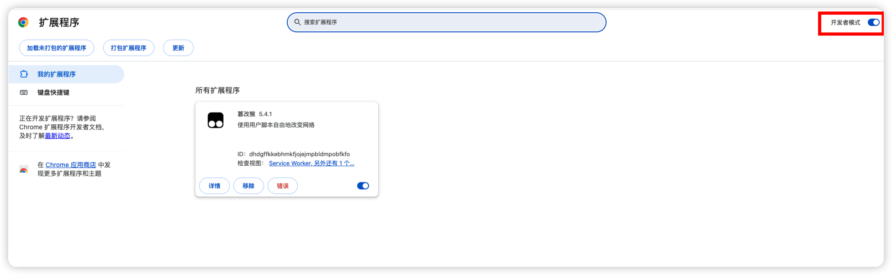
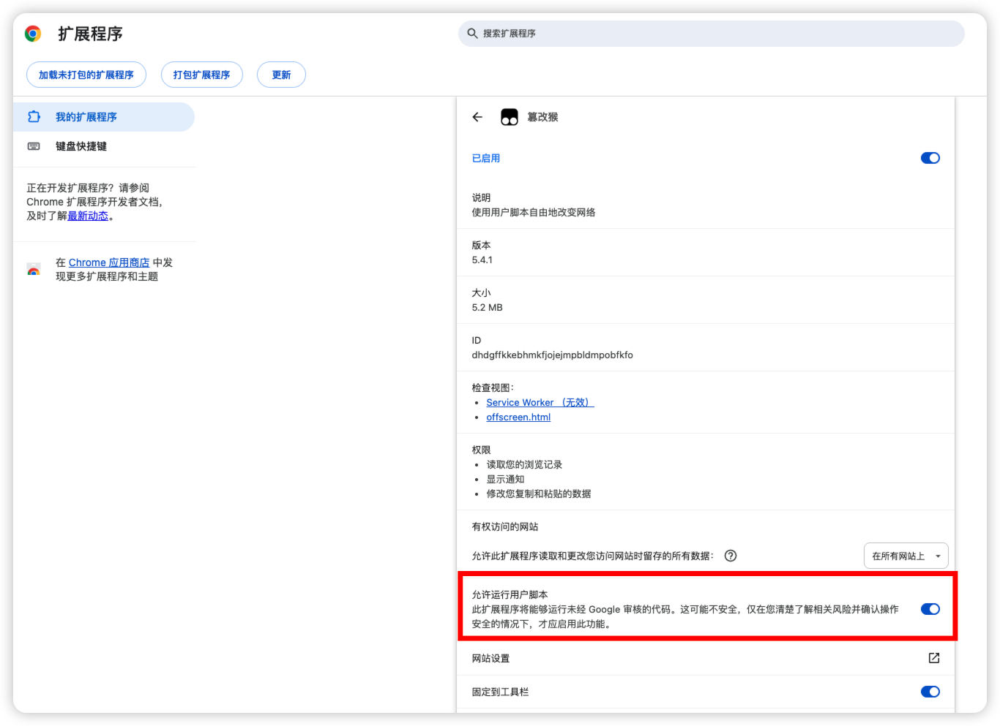
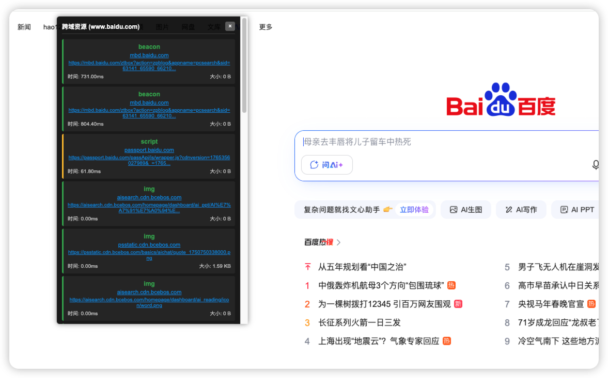

# 篡改猴脚本检测跨域静态资源

## 安装篡改猴插件

- 安装之后，需要打开开发者模式



- 允许运行用户脚本



## 添加用户脚本

- 用户脚本内容如下

```js
// ==UserScript==
// @name         跨域资源监听器
// @version      1.0.0
// @description  监听新的资源加载，并展示与当前窗口hostname不一致的资源
// @author       You
// @match        *://*/*
// @icon         https://www.google.com/s2/favicons?sz=64&domain=tampermonkey.net
// @run-at       document-idle
// @grant        none
// ==/UserScript==
 
(function () {
    // 获取当前页面的hostname
    const currentHostname = window.location.hostname;
    
    // 创建UI容器
    function createUIContainer() {
        const container = document.createElement('div');
        container.id = 'cross-origin-resource-monitor';
        container.style.cssText = `
            position: fixed;
            top: 10px;
            left: 100px;
            width: 350px;
            max-height: 60vh;
            background: rgba(0, 0, 0, 0.9);
            color: white;
            font-family: Arial, sans-serif;
            font-size: 12px;
            border-radius: 5px;
            padding: 10px;
            overflow-y: auto;
            z-index: 999999;
            box-shadow: 0 0 10px rgba(0, 0, 0, 0.5);
        `;
        
        // 创建标题
        const title = document.createElement('div');
        title.style.cssText = `
            font-weight: bold;
            padding-bottom: 5px;
            margin-bottom: 10px;
            border-bottom: 1px solid #444;
            display: flex;
            justify-content: space-between;
            align-items: center;
        `;
        
        // 创建关闭按钮
        const closeButton = document.createElement('button');
        closeButton.style.cssText = "background: #666; color: white; border: none; border-radius: 3px; padding: 2px 6px; cursor: pointer;";
        closeButton.textContent = '×';
        closeButton.addEventListener('click', () => {
            container.style.display = 'none';
        });
        
        // 创建标题文本
        const titleText = document.createElement('span');
        titleText.textContent = `跨域资源 (${currentHostname})`;
        
        // 组装标题
        title.appendChild(titleText);
        title.appendChild(closeButton);
        container.appendChild(title);
        
        // 创建资源列表容器
        const listContainer = document.createElement('div');
        listContainer.id = 'cross-origin-resource-list';
        listContainer.style.marginTop = '5px';
        container.appendChild(listContainer);
        
        // 先添加到DOM
        document.body.appendChild(container);
        
        return listContainer;
    }
    
    // 创建资源项
    function createResourceItem(entry) {
        try {
            const resourceUrl = new URL(entry.name);
            const resourceHostname = resourceUrl.hostname;
            
            // 如果没有hostname或与当前页面hostname相同，则不显示
            if (!resourceHostname || resourceHostname === currentHostname) {
                return null;
            }
            
            const item = document.createElement('div');
            item.style.cssText = `
                padding: 8px;
                margin-bottom: 5px;
                background: rgba(255, 255, 255, 0.05);
                border-radius: 3px;
                border-left: 3px solid #4CAF50;
                word-break: break-all;
            `;
            
            // 根据资源类型设置不同的左侧边框颜色
            if (entry.initiatorType === 'image') {
                item.style.borderLeftColor = '#2196F3';
            } else if (entry.initiatorType === 'script') {
                item.style.borderLeftColor = '#FFC107';
            } else if (entry.initiatorType === 'css') {
                item.style.borderLeftColor = '#E91E63';
            } else if (entry.initiatorType === 'fetch' || entry.initiatorType === 'xmlhttprequest') {
                item.style.borderLeftColor = '#9C27B0';
            }
            
            // 资源信息
            const info = document.createElement('div');
            
            // 类型
            const typeDiv = document.createElement('div');
            typeDiv.style.cssText = "font-weight: bold; color: #4CAF50; margin-bottom: 3px;";
            typeDiv.textContent = entry.initiatorType;
            
            // 域名
            const domainDiv = document.createElement('div');
            domainDiv.style.cssText = "font-size: 11px; margin-bottom: 3px;";
            
            // 创建可点击的域名链接
            const domainLink = document.createElement('a');
            domainLink.href = `${resourceUrl.protocol}//${resourceUrl.hostname}`;
            domainLink.target = '_blank';
            domainLink.rel = 'noopener noreferrer';
            domainLink.style.color = '#2196F3';
            domainLink.style.textDecoration = 'underline';
            domainLink.textContent = resourceUrl.hostname;
            domainDiv.appendChild(domainLink);
            
            // URL
            const urlDiv = document.createElement('div');
            urlDiv.style.cssText = "font-size: 10px; color: #aaa; margin-bottom: 3px;";
            
            // 创建可点击的URL链接
            const urlLink = document.createElement('a');
            urlLink.href = entry.name;
            urlLink.target = '_blank';
            urlLink.rel = 'noopener noreferrer';
            urlLink.style.color = '#2196F3';
            urlLink.style.textDecoration = 'underline';
            urlLink.textContent = entry.name.length > 80 ? entry.name.substring(0, 80) + '...' : entry.name;
            urlDiv.appendChild(urlLink);
            
            // 底部信息
            const bottomDiv = document.createElement('div');
            bottomDiv.style.cssText = "display: flex; justify-content: space-between; font-size: 10px; color: #ccc;";
            
            const timeSpan = document.createElement('span');
            timeSpan.textContent = `时间: ${entry.duration.toFixed(2)}ms`;
            
            const sizeSpan = document.createElement('span');
            sizeSpan.textContent = `大小: ${formatSize(entry.encodedBodySize || entry.decodedBodySize || 0)}`;
            
            bottomDiv.appendChild(timeSpan);
            bottomDiv.appendChild(sizeSpan);
            
            // 组装所有元素
            info.appendChild(typeDiv);
            info.appendChild(domainDiv);
            info.appendChild(urlDiv);
            info.appendChild(bottomDiv);
            
            item.appendChild(info);
            return item;
        } catch (e) {
            console.error('解析资源URL出错:', e, entry);
            return null;
        }
    }
    
    // 格式化文件大小
    function formatSize(bytes) {
        if (bytes === 0) return '0 B';
        
        const k = 1024;
        const sizes = ['B', 'KB', 'MB', 'GB'];
        const i = Math.floor(Math.log(bytes) / Math.log(k));
        
        return parseFloat((bytes / Math.pow(k, i)).toFixed(2)) + ' ' + sizes[i];
    }
    
    // 创建UI容器
    const resourceListContainer = createUIContainer();
    
    // 记录已显示的资源URL，避免重复显示
    const displayedResources = new Set();
    
    // 监听新的资源加载
    const observer = new PerformanceObserver((list) => {
        list.getEntries().forEach(entry => {
            try {
                const resourceUrl = new URL(entry.name);
                // 生成唯一标识
                const resourceKey = `${resourceUrl.hostname}-${entry.initiatorType}-${entry.startTime}`;
                
                // 如果已经显示过类似资源，则跳过
                if (displayedResources.has(resourceKey)) {
                    return;
                }
                
                // 添加到已显示集合
                displayedResources.add(resourceKey);
                
                // 创建资源项并添加到UI
                const resourceItem = createResourceItem(entry);
                if (resourceItem) {
                    // 添加到列表顶部
                    resourceListContainer.insertBefore(resourceItem, resourceListContainer.firstChild);
                    
                    // 如果资源过多，删除最旧的
                    if (resourceListContainer.children.length > 20) {
                        resourceListContainer.removeChild(resourceListContainer.lastChild);
                        // 清理集合
                        const keys = Array.from(displayedResources);
                        displayedResources.delete(keys[0]);
                    }
                }
            } catch (e) {
                console.error('处理资源条目出错:', e, entry);
            }
        });
    });

    observer.observe({ entryTypes: ['resource'] });

})();
```


## 页面检测效果

> hostname不一致，认为为跨域

