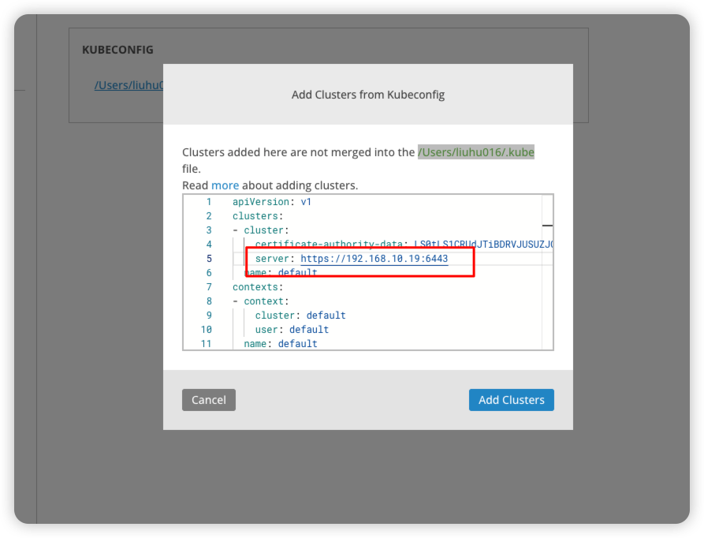

# K3s集群管理

## 一、使用本地软件Lens

### 1. 本地软件下载

> https://lenshq.io/

### 2. 获取k3s.yaml文件内容

```shell
cat /etc/rancher/k3s/k3s.yaml
```

### 3. 添加配置文件



## 二、使用Dashboard网页管理：headlamp

> Github：https://github.com/kubernetes-sigs/headlamp
>
> 官网：https://headlamp.dev/

### K3s中安装

- 下载镜像

  ```shell
  docker pull ghcr.io/headlamp-k8s/headlamp:latest
  ```

- 集群中导入镜像之后

  ```shell
  kubectl apply -f https://raw.githubusercontent.com/kubernetes-sigs/headlamp/main/kubernetes-headlamp.yaml
  ```

- 获取登录Token：参考https://headlamp.dev/docs/latest/installation/

  ```shell
  kubectl -n kube-system create serviceaccount headlamp-admin
  kubectl create clusterrolebinding headlamp-admin --serviceaccount=kube-system:headlamp-admin --clusterrole=cluster-admin
  kubectl create token headlamp-admin -n kube-system
  
  ```

  